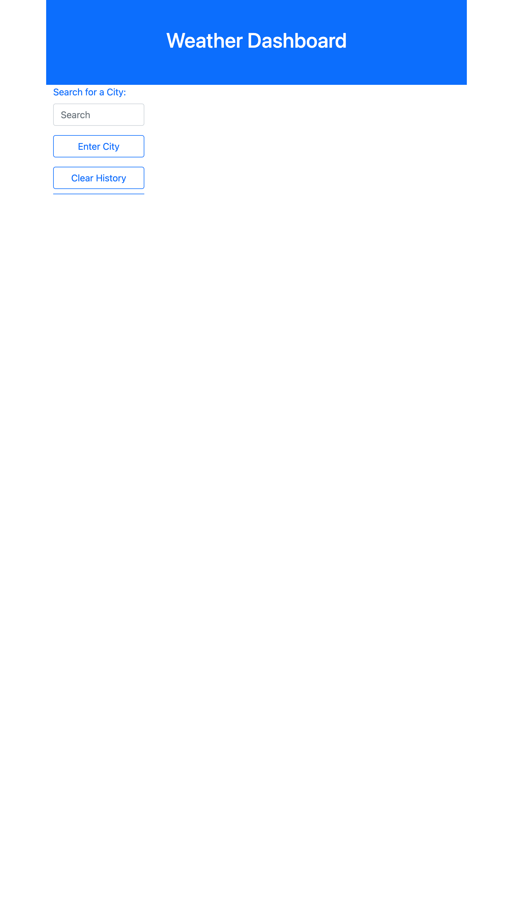
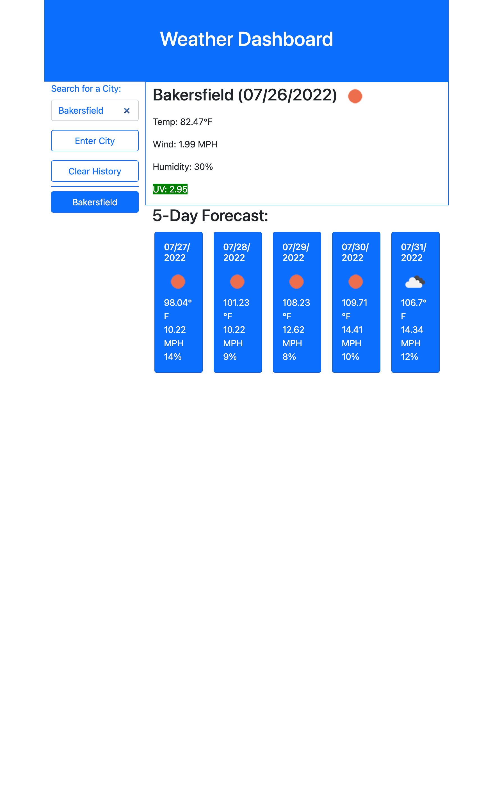

# 06 Weather Dasboard

In this assignment, I was tasked to create a functional weather dashboard that fetched an api and assigned the data inside it to different variables. I then had to display the variables on the page with current information and information for the next 5 days. This application will allow the user to input any city and it will take that value and get the lat and long with the first api call. Then with the second api call it will use the coordinates of the first to pull the weather of the location. This project uses mostly HTML, Bootstrap, and Javascript. 

## User Story

AS A traveler

I WANT to see the weather outlook for multiple cities

SO THAT I can plan a trip accordingly

## Acceptance Criteria

GIVEN a weather dashboard with form inputs

WHEN I search for a city

THEN I am presented with current and future conditions for that city and that city is 
added to the search history

WHEN I view current weather conditions for that city

THEN I am presented with the city name, the date, an icon representation of weather conditions, the temperature, the humidity, the wind speed, and the UV index

WHEN I view the UV index

THEN I am presented with a color that indicates whether the conditions are favorable, moderate, or severe

WHEN I view future weather conditions for that city

THEN I am presented with a 5-day forecast that displays the date, an icon 
representation of weather conditions, the temperature, the wind speed, and the humidity

WHEN I click on a city in the search history

THEN I am again presented with current and future conditions for that city

## Work Completed

*Creates 2 API calls

*Changes uv classes to colors to match uv rays

*Gets past cities in local storage

*Adds a gitignore

*Adds date with moment()

*Uses for loop to create five day forecast cards

*Uses for loop to create clickable buttons for search history

*Uses Bootstrap to stylize

*Adds clear history button to remove content

## Deployed Site

The deployed site hosted by GitHub.
https://scottwatt.github.io/weather_dashboard/

## Screenshot

### Full page

### Display

### Search History
